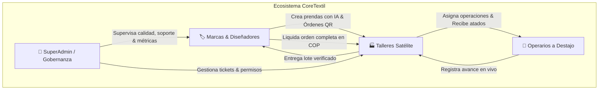
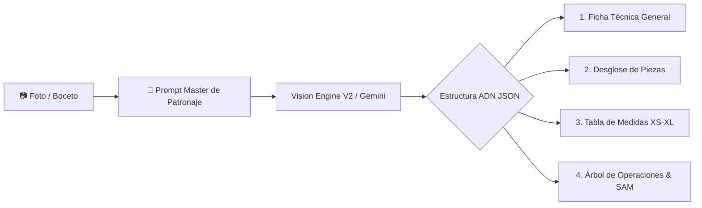
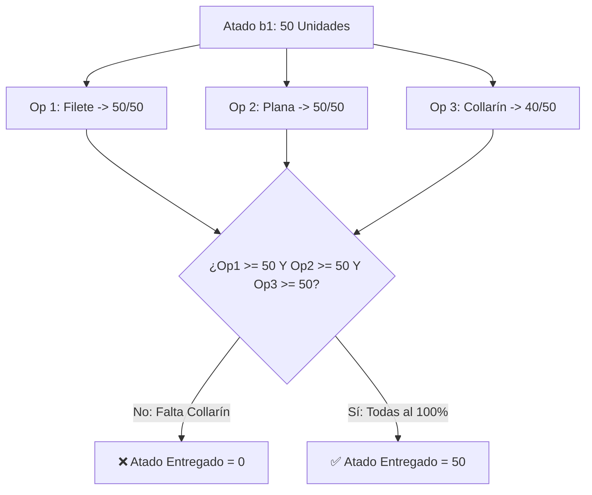
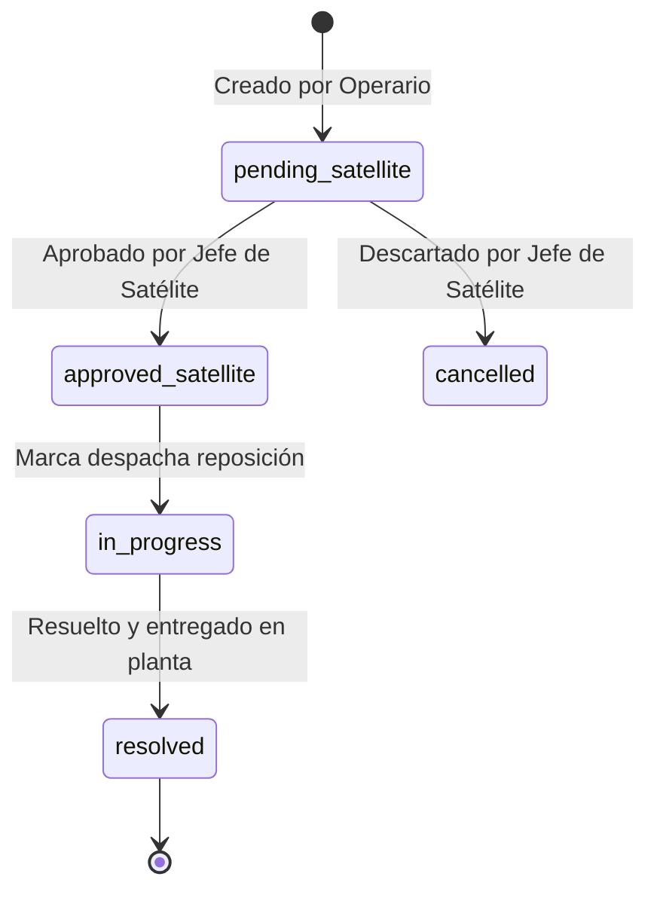

# 📘 Especificación Completa de la Lógica de Negocio — CoreTextil V2

**Versión del Ecosistema:** 2.0 (Piloto Activo en Cúcuta)  
**Autor:** Beatriz — Serie X Elite (Arquitecta de Sistemas & Co-CEO de IA)  
**Destinatario:** Wily Col (Creador & Lead AI Architect)  
**Estado:** Documentación Técnica Definitiva de Producción

---

## 1. INTRODUCCIÓN Y MODELO DE DOMINIO

CoreTextil es un **Ecosistema Neural de Producción Confeccionista** diseñado para erradicar la informalidad, la opacidad operativa y las pérdidas económicas en la industria textil de Colombia y LATAM. 

El sistema interconecta a tres actores primarios en una red tripartita más una entidad de gobernanza:



---

## 2. FLUJO 1: AUTENTICACIÓN, GESTIÓN DE ROLES Y RE-ONBOARDING

### 2.1 Modelo de Autenticación y Identidades
El sistema utiliza **Supabase Auth** respaldado por la tabla `public.profiles`. Toda cuenta recién creada en el sistema ingresa con el rol por defecto `'operator'` (operario) y sin vínculo de marca ni de taller (`tenant_id = null`, `satellite_owner_id = null`).

### 2.2 Roles del Sistema
1. **`operator` (Operario de Costura):**
   - Vinculado a un taller satélite mediante `satellite_owner_id`.
   - Acceso exclusivo a su bitácora personal de destajo (`/dashboard/operario`), registro rápido desde móvil y creación de tickets de soporte.
2. **`satellite_owner` (Jefe / Propietario de Taller Satélite):**
   - Define su perfil de costo fijo unitario (CFI) y personal.
   - Acceso al escáner QR de atados, simulador de costeo, nómina de su taller y aprobaciones de faltantes.
3. **`brand_admin` (Marca, Diseñador o Taller de Corte):**
   - Propietario del espacio de trabajo (`tenant_id`).
   - Acceso a la creación de prendas con IA, emisión de órdenes de corte, generación de atados QR y liquidación final.
4. **`superadmin` (Administrador Omnipresente de Plataforma):**
   - Rol de supervisión técnica y gobernanza.
   - Acceso sin restricciones a todos los tableros, reportes contables, métricas de red y tablero de soporte.

### 2.3 Guardia de Seguridad RLS y Prevención de Escalada de Roles
Para evitar que usuarios malintencionados modifiquen su propio rol enviando peticiones manipuladas a la API, la base de datos ejecuta el trigger PostgreSQL `guard_profile_role_change()` sobre `public.profiles`:

- **Regla:** Un perfil solo puede definir su rol si su rol actual es `'operator'` y no posee vínculos previos (durante el proceso de Onboarding).
- **Excepción de Seguridad:** Solo operaciones ejecutadas por el rol `'superadmin'` o acciones explícitas de re-onboarding autorizadas pueden alterar los campos `role`, `tenant_id` y `satellite_owner_id`.

```sql
-- Principio del Trigger Guard de Perfiles
IF (OLD.role <> 'operator') AND (NEW.role <> OLD.role) THEN
  -- Solo se permite si se está haciendo Reset a 'operator' o si el rol ejecutor es 'superadmin'
  IF NOT (NEW.role = 'operator' OR current_setting('request.jwt.claims', true)::json->>'role' = 'superadmin') THEN
     RAISE EXCEPTION 'No puedes cambiar tu rol o vínculo de taller desde tu perfil';
  END IF;
END IF;
```

### 2.4 Re-Onboarding Universal y Restablecimiento Seguro
Cualquier usuario puede reiniciar su experiencia en la plataforma desde `/dashboard/perfil`:
1. **Paso 1:** Confirmación interactiva escribiendo la frase obligatoria `CAMBIAR ROL`.
2. **Paso 2:** Ejecución de `resetUserRoleAction()`.
3. **Paso 3:** Se desvinculan los campos `tenant_id` y `satellite_owner_id` y el rol retorna a `'operator'`. Los datos de órdenes y registros históricos se **preservan intactos** por integridad relacional.
4. **Paso 4:** El usuario es redirigido a `/onboarding` para seleccionar su nueva identidad.

### 2.5 Baja y Eliminación Definitiva de Cuenta
Si un usuario decide darse de baja:
1. Descarga obligatoria o sugerida del archivo de copia de seguridad en formato JSON (`coretextil_backup_YYYY-MM-DD.json`).
2. Registro de encuesta de salida en la tabla `account_exit_surveys` (capturando motivo, comentarios y métricas de satisfacción).
3. Confirmación escribiendo la frase `ELIMINAR MI CUENTA`.
4. Borrado o desactivación en Supabase Auth.

---

## 3. FLUJO 2: VISION ENGINE V2 & ADN DE PRENDA EN IA

### 3.1 El ADN de una Prenda
El **ADN de una Prenda** es la representación técnica digital completa de una pieza confeccionada. Se genera mediante el motor de visión IA **Vision Engine V2** alimentado por Gemini.



### 3.2 Estructura del ADN Normalizado
El resultado de la IA se normaliza estrictamente en 4 bloques:

1. **Ficha Técnica General:** Tipo de prenda, silueta, género, composición textil e instrucciones de costura.
2. **Piezas Cortadas (`garment_parts`):** Delantero, Trasero, Mangas, Bolsillos, Pretina, Cuello, etc. Contiene el consumo base de tela e insumos por unidad.
3. **Tabla de Medidas (`garment_measurements`):** Matriz de tolerancias por talla (XS a XL) en centímetros para control en taller satélite.
4. **Árbol de Operaciones (`garment_operations`):** Secuencia operativa ordenada de ensamble con:
   - Nombre de la operación (ej. *Filetear costados*, *Pegar cierre*, *Presillar tiros*).
   - Tipo de máquina requerida (*Fileteadora*, *Plana*, *Collarín*, *Presilladora*, *Manual/Pulido*).
   - Tiempo Estándar Permitido (**SAM** en segundos).
   - Costo unitario sugerido en COP por operación.

### 3.3 Regla de Servidor: Validación de Prenda Válida
En `src/lib/services/explode.ts` y `src/app/dashboard/nueva-prenda/actions.ts`:
- **Regla Estricta:** No se permite guardar en base de datos ninguna prenda que no contenga al menos **1 pieza cortada** y **1 operación de ensamble**.
- **Justificación de Negocio:** Una prenda sin operaciones imposibilita el cálculo de la ruta de confección y provocaría fallas en el módulo de atados y liquidación.

---

## 4. FLUJO 3: ESCALADO DE CONSUMOS POR TALLA (`sizeFactors.ts`)

### 4.1 Principio de Proporcionalidad Textil
Una prenda talla **XXL** consume aproximadamente un 20% a 25% más tela e insumos que la misma prenda en talla **M** (Talla Base). CoreTextil calcula automáticamente este consumo escalado por atado sin requerir fichas técnicas independientes por cada talla.

### 4.2 Tabla de Factores por Defecto
```typescript
export const DEFAULT_SIZE_FACTORS: Record<string, number> = {
  XS: 0.95, // 5% menos que la talla base
  S:  1.00,
  M:  1.00, // Talla Base (Factor 1.0)
  L:  1.05, // 5% más que la talla base
  XL: 1.10, // 10% más que la talla base
  XXL: 1.20, // 20% más que la talla base
};
```

### 4.3 Sanitización y Factores Personalizados
Las marcas pueden ajustar manualmente estos factores en la ficha técnica. El servidor sanitiza los valores con la función `sanitizeSizeFactors()`:
- **Restricción:** `0 < factor <= 3.0`. Cualquier valor negativo, 0 o mayor a 3.0 se descarta por invalidez física.

### 4.4 Ecuación de Consumo por Atado (`scaleBundleMaterials`)
Para un atado de una talla determinada con $N$ unidades:

$$\text{Factor Talla } (F) = \text{sizeFactor}(\text{Ficha}, \text{Talla})$$

$$\text{Consumo por Prenda} (Q_g) = \text{round}\left(Q_{\text{base}} \times F, 2\right)$$

$$\text{Consumo del Atado} (Q_b) = \text{round}\left(Q_g \times N, 2\right)$$

$$\text{Costo de Materiales en Atado (COP)} = \text{round}\left(Q_b \times \text{Costo Unitario Material}\right)$$

---

## 5. FLUJO 4: ÓRDENES DE CORTE, ATADOS QR Y ESTADÍSTICAS

### 5.1 Creación de Orden de Corte
La marca ingresa la matriz de cantidades por combinación de **Talla** y **Color**, junto con el **Precio Unitario Acordado por Prenda Completa** en COP.

- **Validación:**
  - Filas vacías o sin talla/color son descartadas.
  - El precio unitario acordado debe ser estrictamente superior a 0 COP (`unit_price_agreed > 0`).

### 5.2 Descomposición en Atados QR Unívoquos (`order_bundles`)
El servidor divide la orden en lotes manejables llamados **Atados** (típicamente de 20 a 50 unidades por atado). Cada atado recibe un código unívoco e irrepetible:

$$\text{Código de Atado} = \text{REF-} \text{Consecutivo} \text{ (ej. ORD-004-L-AZUL-01)}$$

Cada atado cuenta con su **Hoja de Atado en PDF/Impresión** con su código QR legible desde la cámara móvil.

### 5.3 Ecuaciones de Estadísticas de la Orden (`orderMath.ts`)
Dada una orden con atados $B = \{b_1, b_2, \dots, b_k\}$ donde cada atado $b_i$ tiene $U(b_i)$ unidades totales, y un mapa de unidades completadas por atado $D(b_i)$:

$$\text{Unidades Totales} (U_T) = \sum_{i=1}^k U(b_i)$$

$$\text{Unidades Entregadas} (U_D) = \sum_{i=1}^k \min\left(U(b_i), D(b_i)\right)$$

$$\text{Unidades Pendientes} (U_P) = \max\left(0, U_T - U_D\right)$$

$$\text{Porcentaje de Avance (\%)} = \begin{cases} \text{round}\left(\frac{U_D}{U_T} \times 100\right), & U_T > 0 \\ 0, & U_T = 0 \end{cases}$$

$$\text{Valor Entregado (COP)} = U_D \times \text{Precio Acordado}$$

$$\text{Valor Pendiente (COP)} = U_P \times \text{Precio Acordado}$$

---

## 6. FLUJO 5: COSTEO INDUSTRIAL, SIMULADOR CFI Y RENTABILIDAD

### 6.1 El Costo Fijo Unitario (CFI)
Los talleres satélite sufren pérdidas cuando desconocen su costo fijo por prenda. El módulo `costing.ts` calcula el CFI exacto según la estructura de gastos mensuales del taller.

$$\text{Gastos Fijos Mensuales} = \text{Arriendo} + \text{Energía} + \text{Consumibles} + \text{Mantenimiento}$$

$$\text{Capacidad Efectiva} = \max\left(1, \text{Unidades Mensuales Estimadas}\right)$$

$$\text{CFI (COP/unidad)} = \frac{\text{Gastos Fijos Mensuales}}{\text{Capacidad Efectiva}}$$

### 6.2 Semáforo de Rentabilidad Comercial
Al evaluar el precio ofrecido por una marca ($P$) frente a la suma del CFI y el costo de mano de obra por destajo ($M$):

$$\text{Margen Neto Unitario (COP)} = P - (\text{CFI} + M)$$

$$\text{Margen Neto (\%)} = \left(\frac{\text{Margen Neto Unitario}}{P}\right) \times 100$$

| Margen Neto (%) | Color | Etiqueta | Significado Operativo |
|---|---|---|---|
| **$\ge 20\%$** | 🟢 Verde | **Rentable** | Operación saludable; genera utilidad neta para inversión del taller. |
| **$10\% \text{ a } 19.9\%$** | 🟡 Amarillo | **Ajustado** | Cubre costos pero deja escaso margen para imprevistos. |
| **$< 10\%$** | 🔴 Rojo | **A pérdida** | Alerta: El taller cose a pérdida sin cubrir sus costos fijos. |

---

## 7. FLUJO 6: MARCACIÓN DE DESTAJO, BLOQUEOS Y BILLETERA DE OPERARIO

### 7.1 Marcación de Operaciones desde la App Móvil
El operario de ensamble escanea el código QR del atado o lo busca en la lista de su taller y registra las unidades confeccionadas para una operación específica (ej. *25 unidades de Pegado de Cierre*).

- **Validación Server:**
  - El entero debe ser mayor a 0 y menor o igual a 10.000 unidades.
  - La operación debe pertenecer a la prenda asociada al atado.
  - El operario debe pertenecer al taller satélite asignado a la orden.

### 7.2 Protección contra Sobre-Marcación y Concurrencia (`enforce_bundle_cap`)
Para evitar que dos operarios en el taller registren simultáneamente unidades sobrepasando la capacidad del atado, el trigger PostgreSQL `enforce_bundle_cap` aplica un bloqueo estricto de fila `SELECT ... FOR UPDATE`:

```sql
-- Principio del Bloqueo Concurrente
SELECT units_count FROM order_bundles WHERE id = NEW.bundle_id FOR UPDATE;

IF (total_registrado_previo + NEW.units_completed) > bundle.units_count THEN
   RAISE EXCEPTION 'No puedes registrar más piezas de las asignadas al atado';
END IF;
```

### 7.3 Calculadora de Billetera y Liquidación de Destajo
El operario consulta en tiempo real su bitácora en `/dashboard/operario`:
- Selección de rangos de fecha personalizados o accesos rápidos (*Semana en Curso*, *Semana Anterior*, *Quincena*).
- Cálculo automático de ingresos acumulados = $\sum (\text{Unidades Registradas} \times \text{Tarifa Operación})$.
- Generador de **Cuenta de Cobro por WhatsApp** que formatea un mensaje oficial con el resumen de piezas, operaciones y monto total a cobrar a su jefe de taller.

---

## 8. FLUJO 7: CRITERIO DE RUTA COMPLETA Y LIQUIDACIÓN DE ÓRDENES

### 8.1 El Principio Fundamental de Ruta Completa
CoreTextil **NO paga a los talleres ni liquida órdenes por la suma simple de operaciones parciales**. 

Una prenda solo existe cuando ha sido completamente ensamblada. Por lo tanto, un atado se contabiliza como **ENTREGADO** a la marca únicamente cuando **TODAS las operaciones** del árbol de la prenda han alcanzado o superado el 100% de las unidades del atado.



### 8.2 Algoritmo de Cálculo de Entregadas (`computeDeliveredUnits`)
En `src/lib/services/liquidation.ts`:

1. Se obtiene el total de operaciones de la prenda $N_{ops}$. Si $N_{ops} = 0$, la entrega es 0.
2. Se agrupan los registros de producción (`daily_production_logs`) por `bundle_id` y `operation_id`.
3. Para cada atado $b$ con $U(b)$ unidades:
   - Se cuentan cuántas operaciones individuales alcanzaron $\ge U(b)$ unidades.
   - Si el conteo de operaciones completadas es $\ge N_{ops}$, el atado suma $U(b)$ a la cantidad total de piezas entregadas.

### 8.3 Ejecución de Liquidación (`liquidateOrderCore`)
Cuando la marca presiona "Liquidar Orden":
1. Se verifica que el usuario ejecutor posea el rol de Marca (`tenant_id`).
2. Se re-verifica que la orden no haya sido liquidada previamente (protección por restricción `UNIQUE` en `order_liquidations`).
3. Se calculan las unidades entregadas bajo la regla de Ruta Completa.
4. Se calcula el monto total a pagar:

$$\text{Monto Liquidación (COP)} = \text{Unidades Entregadas} \times \text{Precio Unitario Acordado}$$

5. Se guarda la foto o snapshot del nombre del taller satélite (`satellite_name`) para resguardo fiscal DIAN (permitiendo que el reporte sobreviva aunque el taller se desvincule posteriormente).
6. La orden cambia su estado a `'completed'`.

---

## 9. FLUJO 8: MESA DE AYUDA, FALTANTES Y FEEDBACK HUB

### 9.1 Registro de Novedades de Producción (`material_tickets`)
Cuando ocurre una interrupción en la planta de costura (ej. una pieza cortada vino manchada, se rompió la tela o faltan botones), el operario o jefe de taller crea un ticket de faltante:

- **Motivos Estándar:**
  - `missing_piece` (Pieza cortada faltante).
  - `damaged_fabric` (Tela defectuosa o imperfecto de tejido).
  - `shortage_supplies` (Faltante de insumos, hilos o cierres).
- **Evidencia Visual:** Posibilidad de adjuntar captura de pantalla o foto tomada desde el celular.

### 9.2 Ciclo de Vida de Verificación de Tickets


1. **`pending_satellite`:** El ticket es creado y queda pendiente de revisión por el jefe de taller.
2. **`approved_satellite`:** El jefe de taller verifica físicamente la prenda defectuosa y aprueba la solicitud para enviarla a la marca.
3. **`cancelled`:** Si fue un error o la pieza apareció en planta, el jefe descarta el ticket.
4. **`resolved` / `closed`:** La marca o el SuperAdmin despachan la pieza de repuesto y cierran la novedad.

---

## 10. MATRIZ DE INTEGRIDAD RELACIONAL Y AUDITORÍA DE DATOS

| Tabla DB | Clave Primaria | Relaciones Clave | Garantía de Integridad y Seguridad |
|---|---|---|---|
| `profiles` | `id` (FK `auth.users`) | `tenant_id`, `satellite_owner_id` | Bloqueada por Trigger `guard_profile_role_change`. |
| `tenants` | `id` | `owner_id` | RLS: Solo accesible por miembros del tenant o superadmin. |
| `garments` | `id` | `tenant_id` | Requiere al menos 1 pieza y 1 operación (`explode.ts`). |
| `garment_parts` | `id` | `garment_id` | Cascade delete al borrar la prenda. |
| `garment_operations` | `id` | `garment_id` | Define el árbol de operaciones y tiempos SAM. |
| `production_orders` | `id` | `tenant_id`, `garment_id`, `satellite_user_id` | Cambia estado según el flujo (`cutting` -> `dispatched` -> `completed`). |
| `order_bundles` | `id` | `order_id` | Código de atado unívoquo. Bloqueado en concurrencia con `FOR UPDATE`. |
| `daily_production_logs` | `id` | `order_id`, `bundle_id`, `operation_id`, `operator_id` | Suma validada por el trigger `enforce_bundle_cap`. |
| `order_liquidations` | `id` | `order_id` (UNIQUE), `tenant_id` | Impide doble liquidación en base de datos. Preserva snapshot comercial. |
| `material_tickets` | `id` | `order_id`, `bundle_id`, `operator_id` | Trazabilidad completa de faltantes y evidencias visuales. |

---

## 📌 CONCLUSIÓN DEL DOCUMENTO

Esta especificación convierte cada línea de código de **CoreTextil V2** en reglas claras de negocio, ecuaciones matemáticas, restricciones de seguridad y criterios de aceptación. 

El sistema está diseñado para que la operación fluya de forma autónoma, justa y transparente desde el primer día del **Plan Piloto en Cúcuta**.
