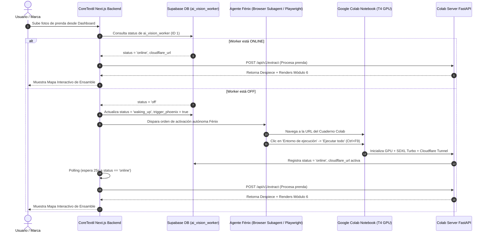

# Especificación Técnica: Protocolo de Activación Autónoma de Colab por Agente Fénix

## 1. Visión General
El **Agente Fénix** actúa como un operador sintético autónomo (Human-in-the-Loop Emulation) responsable de encender la infraestructura del **Vision Engine V2** en Google Colab cuando la tabla `ai_vision_worker` en Supabase reporta estado `off` o `waking_up`.

---

## 2. Flujo de Activación Autónoma



---

## 3. URLs y Parámetros del Agente Fénix

- **URL Objetivo del Cuaderno Colab:**
  `https://colab.research.google.com/drive/1De_ueOYpaSGU5gJQGdWiCAPIRhnPXtic#scrollTo=TOF5f4nXDoMJ`
- **Comando de Encendido Autónomo:**
  1. Detectar el menú superior: `Entorno de ejecución` (`Runtime`).
  2. Hacer clic en: `Ejecutar todo` (`Run all`).
  3. Si aparece el modal de advertencia *"Este cuaderno no ha sido creado por Google"*, presionar el botón `Ejecutar de todos modos`.
- **Condición de Parada de Fénix:**
  - Monitorear la consola hasta ver la salida:
    `✅ Estado 'online' registrado exitosamente en Supabase.`
  - Notificar al backend que el worker se encuentra activo.
- **Apagado Automático por Inactividad:**
  - El script `inactivity_monitor()` dentro de `colab_server.py` apaga el tunnel y pone `status = "off"` tras 15 minutos sin peticiones HTTP para no desperdiciar cuotas de Colab.

---

## 4. Script de Automatización de Fénix (Playwright / Python)

```python
import time
from playwright.sync_api import sync_playwright

COLAB_URL = "https://colab.research.google.com/drive/1De_ueOYpaSGU5gJQGdWiCAPIRhnPXtic"

def phoenix_wake_up_colab():
    print("🔥 Agente Fénix: Iniciando protocolo de encendido autónomo de Colab...")
    with sync_playwright() as p:
        browser = p.chromium.launch(headless=False) # Headless=False para depuración o headless=True en servidor
        context = browser.new_context()
        page = context.new_page()
        
        print("🌐 Navegando al cuaderno VisionEngine.ipynb...")
        page.goto(COLAB_URL)
        page.wait_for_load_state("networkidle")
        
        # Simular combinación de teclas Ctrl+F9 (Ejecutar Todo)
        print("⚡ Presionando Ctrl+F9 para ejecutar todas las celdas...")
        page.keyboard.press("Control+F9")
        time.sleep(3)
        
        # Verificar si aparece el botón de confirmación de Google
        run_anyway_btn = page.query_selector("text='Ejecutar de todos modos'") or page.query_selector("text='Run anyway'")
        if run_anyway_btn:
            print("🔘 Haciendo clic en 'Ejecutar de todos modos'...")
            run_anyway_btn.click()
            
        print("⏳ Agente Fénix: Colab ejecutándose. Esperando ping de Supabase...")
        time.sleep(30)
        browser.close()
        print("✅ Agente Fénix: Protocolo completado exitosamente.")

if __name__ == "__main__":
    phoenix_wake_up_colab()
```
