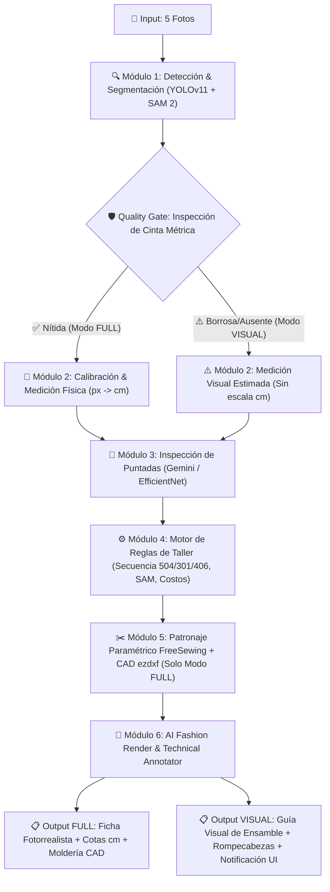

# CoreTextil Vision Engine V2 - Especificación de Arquitectura

## Visión General
El **Motor de Visión V2** es el núcleo de ingeniería inversa, despiece paramétrico y renderizado fotorrealista de CoreTextil. Recibe de 3 a 5 fotos de la prenda de vestir tomada por la marca o taller satélite, valida la legibilidad de escala física, despieza las partes, clasifica la maquinaria/puntadas, genera el mapa de moldería SVG/DXF y produce fichas técnicas fotorrealistas con cotas dinámicas.

---

## 🛡️ Quality Gate con Degradación Grácil (Graceful Degradation UX)

**Filosofía Operativa de Red:** El proceso **nunca se interrumpe abruptamente ni bloquea la producción del taller satélite**.

### Comportamiento del Quality Gate:
1. **SÍ hay Cinta Métrica Nítida:**
   - **Modo:** `FULL_PRECISION`
   - **Resultado:** Despiece visual + Mediciones físicas sub-milimétricas (`px → cm`) + Moldería CAD (`ezdxf`) + Ficha fotorrealista con cotas numéricas.

2. **NO hay Cinta Métrica o está Borrosa:**
   - **Modo:** `VISUAL_GUIDE_ONLY` (Degradación Grácil)
   - **Resultado:**
     - 🛑 Omite la escala métrica física (`px → cm`) y exportación CAD.
     - ✅ **SÍ Genera:** Despiece visual de piezas (Rompecabezas textil).
     - ✅ **SÍ Genera:** Ruta de ensamble del taller (Gantt con 504/301/406).
     - ✅ **SÍ Genera:** Render fotorrealista (Módulo 6) como guía visual (sin cotas numéricas).
   - **Notificación UI Marca:** `"⚠️ Advertencia de Calidad: Cinta métrica borrosa o ausente. Se generó la guía visual de ensamble y el mapa de piezas para el taller, pero la exportación CAD a escala requerirá una foto con cinta nítida."`

---

## 🏗️ Pipeline de 6 Módulos con Degradación Grácil

---

### Módulo 1: Detección & Segmentación (YOLOv11 + SAM 2)
- Detecta ROIs de prenda, partes principales y cinta métrica.
- SAM 2 genera las máscaras de recorte pixel-perfect de las piezas.

### Módulo 2: Calibración & Medición (OpenCV `px → cm`)
- Evaluado por el **Quality Gate**.
- Determina si la salida tendrá precisión métrica industrial (`FULL`) o guía de ensamblaje visual (`VISUAL`).

### Módulo 3: Inspección de Puntadas
- Analiza las fotos del revés (interior) y detalles de cuello/ruedo.
- Clasifica las puntadas industriales (504 Fileteadora, 301 Plana, 406 Collarín).

### Módulo 4: Motor de Reglas de Taller
- Aplica la secuencia real de confección industrial de taller satélite:
  1. Cerrar 1er hombro en fileteadora (Puntada 504).
  2. Pegar rib en 504 por el revés (costura escondida).
  3. Cerrar 2do hombro en fileteadora (504).
  4. Pisar tapa costura en plana (301) o collarín (406).
- Calcula tiempos SAM teóricos y costos por operación.

### Módulo 5: Patronaje Paramétrico & Exportación CAD (FreeSewing + `ezdxf`)
- Genera la moldería paramétrica adaptable por talla (Habilitado en Modo `FULL`).
- Exporta archivos **SVG** y **DXF** para plotters de corte industrial (Lectra, Gerber, Optitex) y CLO3D.

### Módulo 6: AI Fashion Render & Technical Annotator (SaaS Premium Feature)
- **Generación Fotorrealista:** Emplea Google Imagen 3 API / Fal.ai Flux.1 Pro API para renderizar la prenda en modelo 3D virtual o estudio comercial.
- **Renderizado Adaptativo de Cotas:** En modo `FULL` dibuja las cotas métricas en cm. En modo `VISUAL` entrega la guía limpia de producto.
- **Impacto en Red:** Garantiza que el satélite y los operarios reciban siempre la guía visual de atados y reporte de piezas dañadas/faltantes (`material_tickets`) sin importar errores de foto de la marca.
